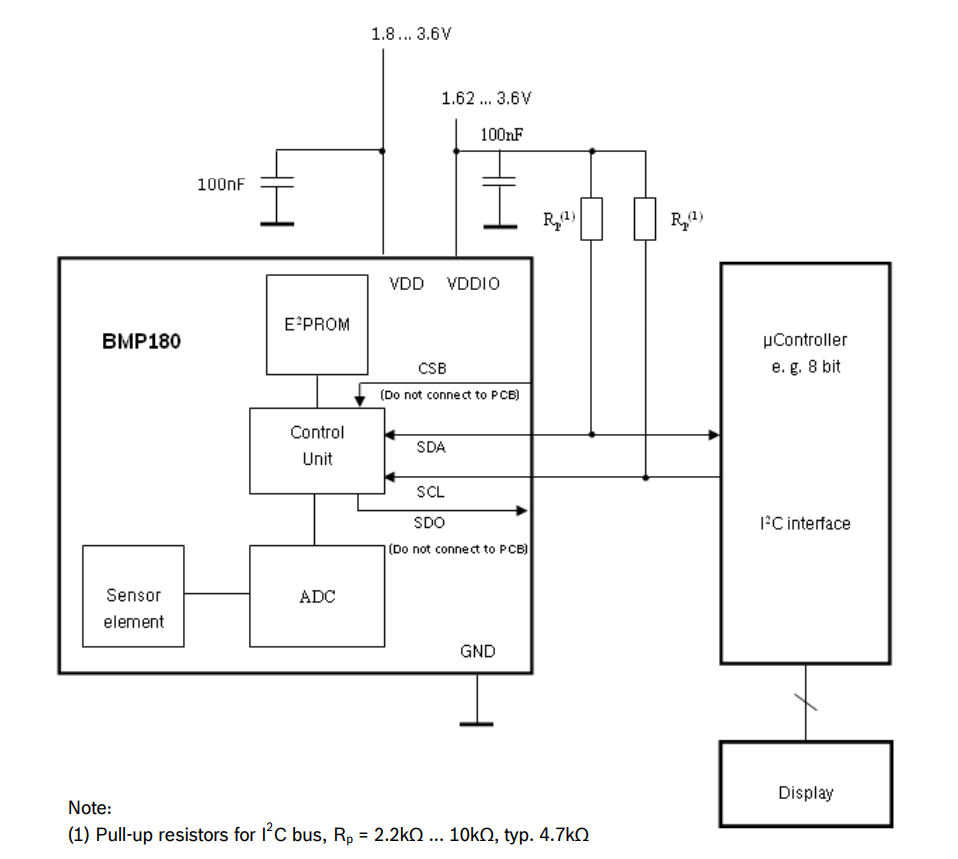
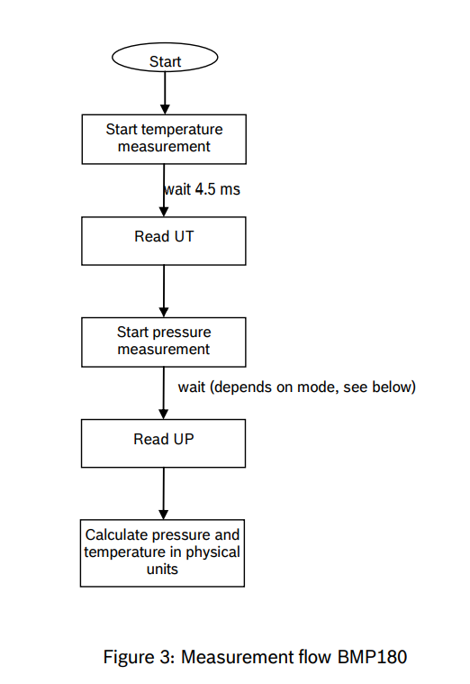
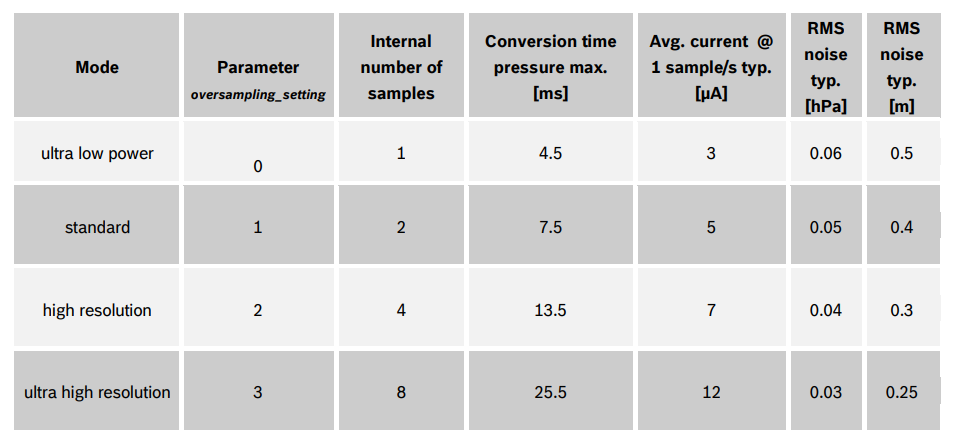

# BMP180

The BMP180 is a very ‘simple to use’ Pressure sensor, which senses the atmospheric Pressure. This Pressure can be used to calculate the Altitude from the sea level. BMP180 also have an integrated Temperature Sensor. It uses the I2C for the communication, and delivers the uncompensated values of pressure and temperature.

Datasheet: https://cdn-shop.adafruit.com/datasheets/BST-BMP180-DS000-09.pdf

## Work flow

## Selcet Mode 0

