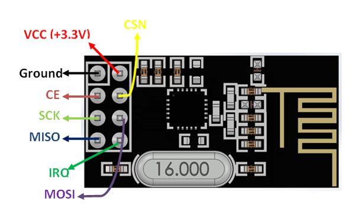
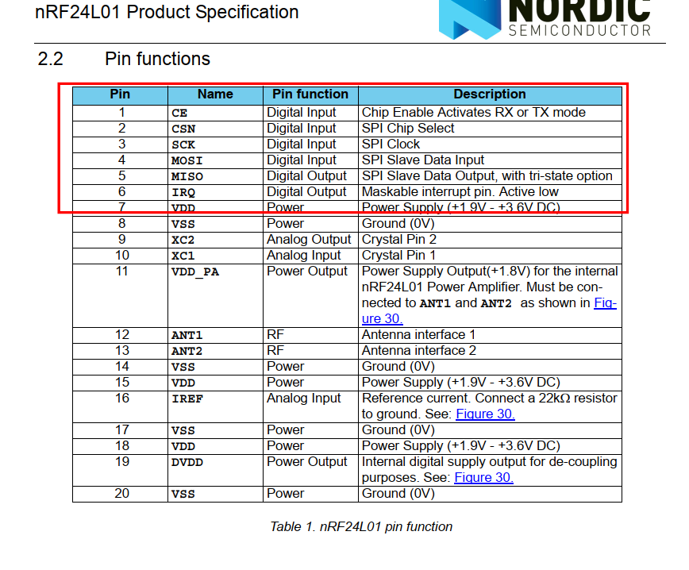
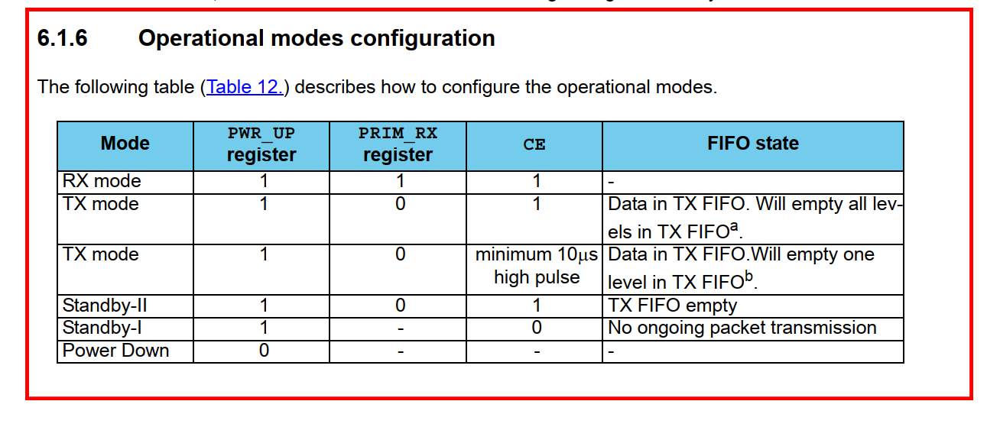
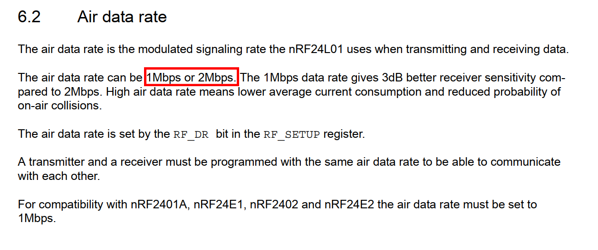
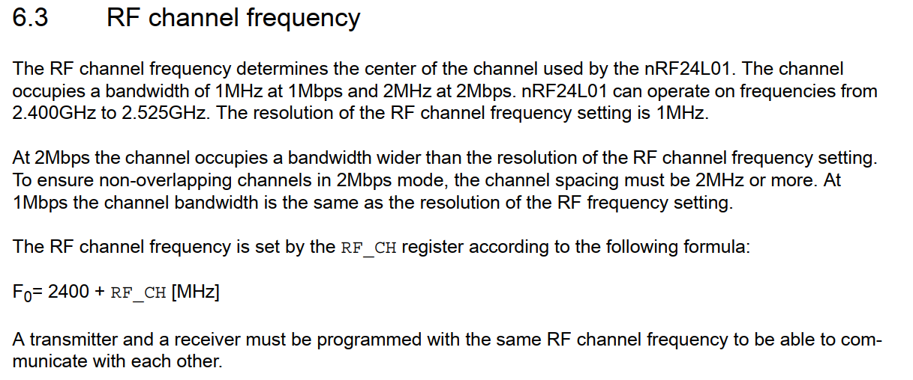
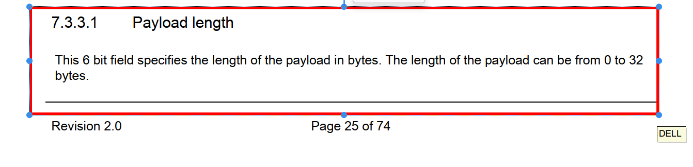
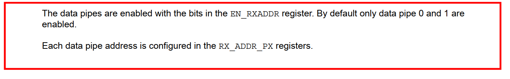
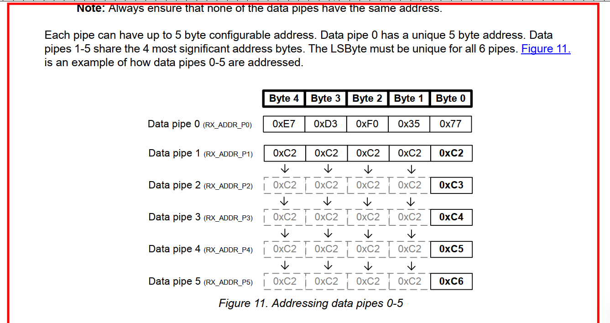
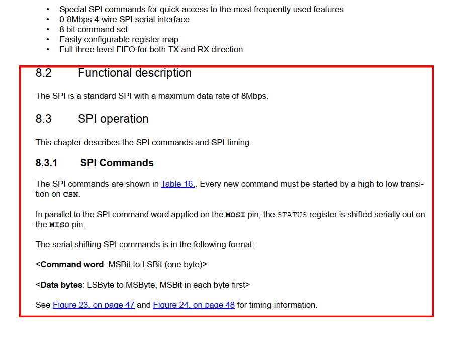

# NRF24L01

## Pin defination

## Operational mode configuration

## Air data rate

## RF channel frequency

## Payload length

## Data pipe

## SPI Command

### **Để tốc độ SPI dưới 8MBit/s**